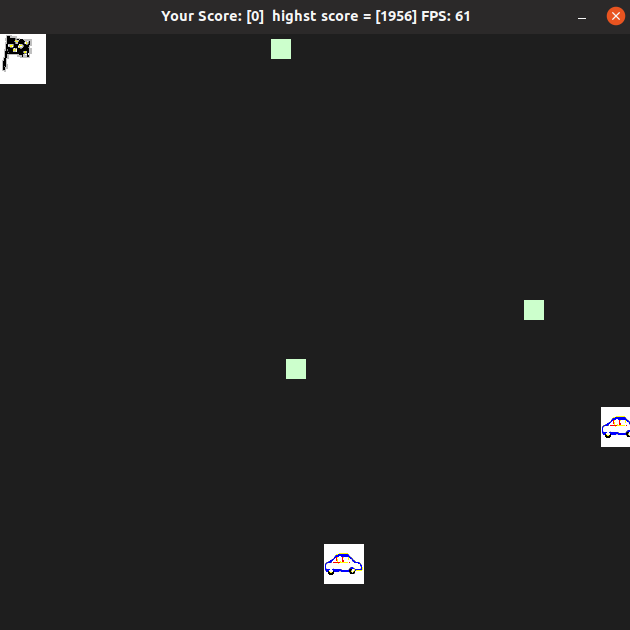

# CPPND: Capstone Duality Game 

This a capstone project submitted for the nanodegree (Udacity C++ Nanodegree). This project is not built from scratch. It was built based on the starter repo for the Capstone project in the [Udacity C++ Nanodegree Program](https://www.udacity.com/course/c-plus-plus-nanodegree--nd213). I chose to build a new game inspired by the snake game.

### The concept of the game is as follow:
- There is a car on the canvus trying to reach to the end flag.
- The user can use arrow keys to guid the car.
- There are multiple mobile obstacles that if the car collide with, the car will stop permanently.
- Till this line the concept is easy and naive; However, there is another car that the user should guid too ; hence the name DualGame. So, literally the programe is multithreaded and the user should be multithreaded to guide two cars simultaneously :).
- So, how can the user guide two cars? The answer is by arrow keys. However, the user should use Ctrl key (right or left) to shift from car to car.
- Whenever the two cars reached to the end flag, a new level is started with more obstacles.
- if one car is hit by an obstacle the other car should reach to the flag so the level will be reset.

## Dependencies for Running Locally
* cmake >= 3.7
  * All OSes: [click here for installation instructions](https://cmake.org/install/)
* make >= 4.1 (Linux, Mac), 3.81 (Windows)
  * Linux: make is installed by default on most Linux distros
  * Mac: [install Xcode command line tools to get make](https://developer.apple.com/xcode/features/)
  * Windows: [Click here for installation instructions](http://gnuwin32.sourceforge.net/packages/make.htm)
* SDL2 >= 2.0
  * All installation instructions can be found [here](https://wiki.libsdl.org/Installation)
  * Note that for Linux, an `apt` or `apt-get` installation is preferred to building from source.
* gcc/g++ >= 5.4
  * Linux: gcc / g++ is installed by default on most Linux distros
  * Mac: same deal as make - [install Xcode command line tools](https://developer.apple.com/xcode/features/)
  * Windows: recommend using [MinGW](http://www.mingw.org/)

## Basic Build Instructions

1. Clone this repo.
2. Make a build directory in the top level directory: `mkdir build && cd build`
3. Compile: `cmake .. && make`
4. Run it: `./DualGame`.
## The following rubric criteria are tackled:

### A README with instructions is included with the project

Done

### The README indicates which project is chosen.

Done

### The README includes information about each rubric point addressed.

Done

### The submission must compile and run.
Done (on ubunto 19)

### The project demonstrates an understanding of C++ functions and control structures.

Done

### The project reads data from a file and process the data, or the program writes data to a file.

Done ( the highest score is recorded in a file "result.txt")

### The project accepts user input and processes the input.
Done (user input is mainly by Ctrl and arrow keys)

### The project uses Object Oriented Programming techniques.
Done 

### Classes use appropriate access specifiers for class members.
Done

### Class constructors utilize member initialization lists.
Done

### Classes abstract implementation details from their interfaces.
Done

### Classes encapsulate behavior.
Done

### Classes follow an appropriate inheritance hierarchy.
Not done!! ( Although it could be improved more e.g. the car object and the obstacle object can be designed to inherit a parent object named movable.. Because both obstacle and cars depends mainly on the move() function)

### Overloaded functions allow the same function to operate on different parameters.
Not done

### Derived class functions override virtual base class functions.
Not done

### Templates generalize functions in the project.
Done ( randomizer genRand() method is generic )

### The project makes use of references in function declarations.
Done

### The project uses scope / Resource Acquisition Is Initialization (RAII) where appropriate.
Done

### The project follows the Rule of 5.
Done ( copy and move constructors with assignment done for the obstacle object)

### The project uses move semantics to move data, instead of copying it, where possible.
Done ( when creating objects in the scope of the for-loop and inserting them in a vector outside the loop)

### The project uses smart pointers instead of raw pointers.
Done ( the car is dealt with by a shared_ptr)

### The project uses multithreading.
Done

### A promise and future is used in the project.
Not Done

### A mutex or lock is used in the project.
Done

### A condition variable is used in the project.
Done